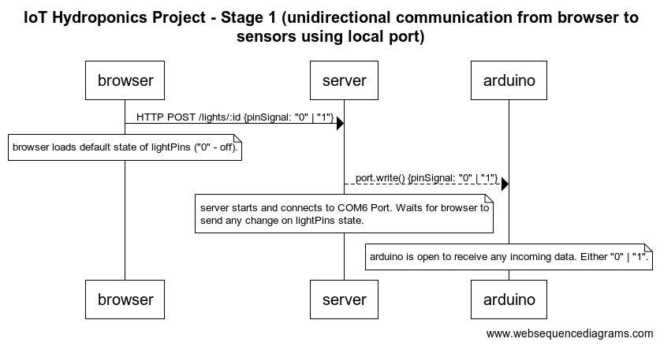

# IoT Hydroponics Project

Author: Martín I. Lupa, Oct 2022

## Stage 1 - Unidirectional communication from browser to sensors using local port.

### Frontend:

- React

### Backend:

- Node and Express server
- Serialport library

---

## Stage 2 - Bidirectional communication using MQTT protocol
